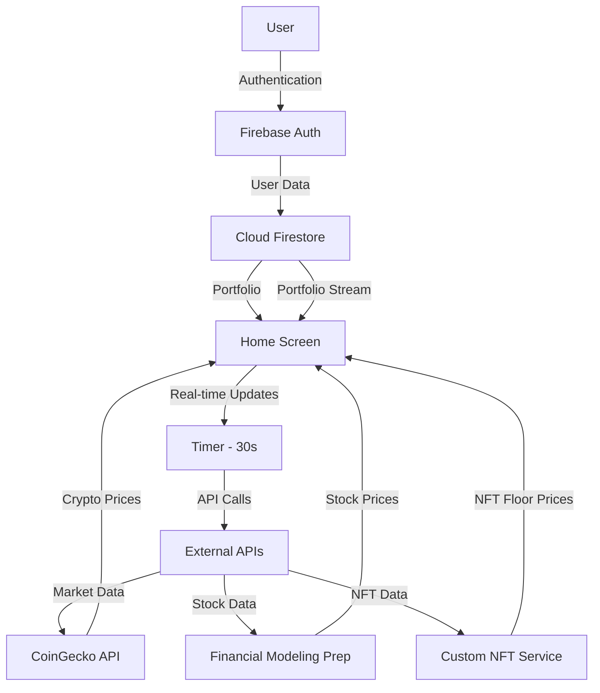

# 🚀 Crypto Exchange Wallet

<div align="center">


**A modern, secure, and feature-rich cryptocurrency wallet application built with Flutter**

[Features](#-features) • [Tech Stack](#-tech-stack) • [Architecture](#-architecture) • [Getting Started](#-getting-started) • [Screenshots](#-screenshots)

</div>

---

## 📱 Overview

Crypto Exchange Wallet adalah aplikasi mobile yang memungkinkan pengguna untuk mengelola portofolio cryptocurrency, saham, dan NFT mereka dalam satu platform yang terintegrasi. Aplikasi ini menyediakan real-time market data, news feed, dan fitur pertukaran crypto yang aman.

## ✨ Features

### 🔐 Authentication & Security
- **Email/Password Authentication** menggunakan Firebase Auth
- **Google Sign-In** untuk kemudahan akses
- **Password Reset** via email
- **Automatic Wallet Generation** saat pendaftaran
- **Secure Data Storage** dengan Firestore

### 💼 Portfolio Management
```
📊 Multi-Asset Support
├── Cryptocurrency (50+ coins)
├── Stocks (20+ popular stocks)
└── NFT Collections (15+ collections)
```

- **Real-time Price Updates** setiap 30 detik
- **Portfolio Value Tracking** dengan persentase perubahan
- **Custom Portfolio** - tambah/kurangi holdings
- **Historical Data** - track performa investasi

### 💱 Exchange & Trading
- **Crypto-to-Crypto Exchange**
- **Real-time Exchange Rates** dari CoinGecko API
- **Network Fee Calculation**
- **Transaction Confirmation** dengan detail lengkap
- **Exchange History** (coming soon)

### 📈 Market Discovery
- **Trending Cryptocurrencies** berdasarkan volume dan market cap
- **News Feed** dengan kategori (Market, Technology, DeFi, NFT, Regulation)
- **Price Charts** dan market statistics
- **Filter & Search** functionality

### 💸 Send & Receive
- **QR Code Generation** untuk menerima crypto
- **QR Code Scanner** untuk kirim crypto
- **Multi-Network Support** (Bitcoin, Ethereum, BSC, Solana, dll)
- **Address Validation**
- **Transaction Notes**

### 📊 Activity Tracking
- **Transaction History** dengan filter
- **Transaction Details** lengkap dengan hash
- **Status Tracking** (Completed, Pending, Failed)
- **Transaction Categories** (Send, Receive, Buy, Sell, Swap)

### 👤 Profile Management
- **User Profile** dengan wallet address
- **Account Verification** status
- **Settings & Preferences**
- **Security Options** (2FA, Password Change)
- **Support Center**

---

## 🛠 Tech Stack

### Frontend Framework
- **Flutter 3.x** - Cross-platform mobile development
- **Dart 3.x** - Programming language

### Backend & Database
- **Firebase Authentication** - User authentication
- **Cloud Firestore** - NoSQL database untuk user data & portfolio
- **Firebase Storage** - File storage (future implementation)

### API Integration
| Service | Purpose | Endpoint |
|---------|---------|----------|
| **CoinGecko API** | Crypto prices & market data | `api.coingecko.com/api/v3` |
| **Financial Modeling Prep** | Stock market data | `financialmodelingprep.com/api/v3` |
| **Custom NFT Data** | NFT collections & floor prices | Built-in fallback data |

### State Management
- **StatefulWidget** untuk local state
- **StreamBuilder** untuk real-time data
- **Timer** untuk auto-refresh

### UI/UX Libraries
```dart
dependencies:
  flutter:
    sdk: flutter
  
  # Firebase
  firebase_core: ^2.24.0
  firebase_auth: ^4.15.0
  cloud_firestore: ^4.13.0
  google_sign_in: ^6.1.5
  
  # Network
  http: ^1.1.0
  
  # UI Components
  qr_flutter: ^4.1.0
  intl: ^0.18.1
  
  # Utilities
  flutter/services.dart  # Clipboard, System Chrome
```

---

## 🏗 Architecture

### 📂 Project Structure

```
lib/
├── 📱 screens/              # UI Screens
│   ├── auth_wrapper.dart    # Authentication flow handler
│   ├── login_screen.dart    # Login page
│   ├── register_screen.dart # Registration page
│   ├── home_screen.dart     # Main dashboard
│   ├── activity_screen.dart # Transaction history
│   ├── exchange_screen.dart # Crypto exchange
│   ├── discover_screen.dart # News & trending
│   ├── profile_screen.dart  # User profile
│   ├── send_screen.dart     # Send crypto
│   ├── receive_screen.dart  # Receive crypto
│   └── qr_scanner_screen.dart # QR scanner
│
├── 📦 models/               # Data Models
│   ├── crypto_asset.dart    # Cryptocurrency model
│   ├── stock_asset.dart     # Stock asset model
│   ├── nft_asset.dart       # NFT model
│   ├── transaction.dart     # Transaction model
│   ├── user_profile.dart    # User profile model
│   └── news_article.dart    # News article model
│
├── 🔧 services/             # Business Logic
│   ├── auth_service.dart    # Authentication service
│   ├── crypto_service.dart  # Crypto API service
│   ├── stock_service.dart   # Stock API service
│   ├── nft_service.dart     # NFT API service
│   └── wallet_service.dart  # Wallet management
│
├── 🎨 widgets/              # Reusable Components
│   ├── wallet_card.dart     # Portfolio summary card
│   ├── crypto_list_item.dart # Crypto item widget
│   ├── transaction_item.dart # Transaction item widget
│   ├── bottom_nav_bar.dart  # Navigation bar
│   └── news_card.dart       # News item widget
│
├── 🎨 utils/                # Utilities
│   ├── app_colors.dart      # Color constants
│   └── database_initializer.dart # Firebase setup
│
└── main.dart                # App entry point
```

### 🔄 Data Flow



---

## 🔐 Security Implementation

### 1. **Authentication Flow**
```dart
// Firebase Authentication dengan email/password
await _authService.signUp(
  email: email,
  password: password,
  name: name,
);

// Automatic wallet generation setelah signup
String _generateWalletAddress() {
  final timestamp = DateTime.now().millisecondsSinceEpoch;
  final userId = _auth.currentUser?.uid ?? 'unknown';
  final hash = userId.hashCode.abs().toString();
  return '0x${hash}${timestamp}';
}
```

### 2. **Data Protection**
- **Firestore Security Rules** untuk akses data
- **Stream-based Updates** untuk real-time sync
- **Local State Management** untuk sensitive data

### 3. **Transaction Security**
- **Confirmation Dialog** sebelum transaksi
- **Network Fee Calculation**
- **Address Validation**
- **Transaction Hash Generation**

---

## 💾 Database Schema

### Firestore Structure

```
users/
  └── {userId}/
      ├── uid: string
      ├── email: string
      ├── name: string
      ├── walletAddress: string
      ├── isVerified: boolean
      ├── createdAt: timestamp
      ├── currency: string (default: "USD")
      ├── language: string (default: "English")
      └── portfolio/
          ├── {cryptoId}/
          │   ├── amount: number
          │   ├── averagePrice: number
          │   └── lastUpdated: timestamp
          ├── {stockSymbol}/
          │   ├── amount: number
          │   ├── averagePrice: number
          │   └── lastUpdated: timestamp
          └── {nftId}/
              ├── amount: number
              ├── averagePrice: number
              └── lastUpdated: timestamp
```

### Sample Data

```json
{
  "users": {
    "user123": {
      "walletAddress": "0x19a15446affabcd1234567890",
      "portfolio": {
        "bitcoin": {
          "amount": 0.04511,
          "averagePrice": 45000.00
        },
        "ethereum": {
          "amount": 3.56,
          "averagePrice": 2500.00
        }
      }
    }
  }
}
```

---

## 🚀 Getting Started

### Prerequisites

- Flutter SDK (>=3.0.0)
- Dart SDK (>=3.0.0)
- Firebase Account
- Android Studio / VS Code
- Android SDK / Xcode (untuk iOS)

### Installation

1. **Clone the repository**
```bash
git clone https://github.com/yourusername/crypto-wallet-app.git
cd crypto-wallet-app
```

2. **Install dependencies**
```bash
flutter pub get
```

3. **Firebase Setup**

   a. Create a new Firebase project at [Firebase Console](https://console.firebase.google.com/)
   
   b. Enable Authentication:
   - Email/Password
   - Google Sign-In
   
   c. Create Cloud Firestore database
   
   d. Download `google-services.json` (Android) dan `GoogleService-Info.plist` (iOS)
   
   e. Place files in:
   ```
   android/app/google-services.json
   ios/Runner/GoogleService-Info.plist
   ```

4. **Configure Firebase**
```bash
# Install Firebase CLI
npm install -g firebase-tools

# Login to Firebase
firebase login

# Initialize FlutterFire
flutterfire configure
```

5. **Run the app**
```bash
# Debug mode
flutter run

# Release mode
flutter run --release
```

---

## 📱 User Flow

### 1️⃣ Registration & Onboarding

```
┌─────────────┐     ┌──────────────┐     ┌─────────────┐
│   Splash    │ ──> │    Login     │ ──> │  Register   │
│   Screen    │     │    Screen    │     │   Screen    │
└─────────────┘     └──────────────┘     └─────────────┘
                            │                     │
                            │                     ▼
                            │            ┌─────────────────┐
                            │            │ Create Account  │
                            │            │ Generate Wallet │
                            │            │ Init Portfolio  │
                            │            └─────────────────┘
                            │                     │
                            └─────────┬───────────┘
                                      ▼
                            ┌─────────────────┐
                            │   Home Screen   │
                            │  (Portfolio)    │
                            └─────────────────┘
```

### 2️⃣ Main Features Flow

```
Home Screen
    │
    ├── 📊 View Portfolio
    │   ├── Switch Tabs (Cash/Crypto/Stocks/NFT)
    │   ├── Real-time Price Updates (30s)
    │   └── Tap Asset → Details
    │
    ├── 💱 Exchange
    │   ├── Select From Crypto
    │   ├── Select To Crypto
    │   ├── Enter Amount
    │   ├── Preview Exchange
    │   └── Confirm → Execute
    │
    ├── 📰 Discover
    │   ├── View Trending Cryptos
    │   ├── Browse News (Filter by Category)
    │   └── Tap Article → Read Details
    │
    ├── 📋 Activity
    │   ├── View Transaction History
    │   ├── Filter (All/Sent/Received/Trade)
    │   └── Tap Transaction → Details
    │
    └── 👤 Profile
        ├── View User Info
        ├── Edit Profile
        ├── Settings
        └── Logout
```

### 3️⃣ Transaction Flow

#### Send Crypto
```
Home → Send Button
    │
    ├── Select Cryptocurrency
    ├── Enter Recipient Address
    │   ├── Paste from Clipboard
    │   └── Scan QR Code
    ├── Enter Amount
    ├── Add Note (optional)
    ├── Preview Transaction
    │   ├── Network Fee
    │   └── Total Amount
    └── Confirm → Success
```

#### Receive Crypto
```
Home → Receive Button
    │
    ├── Select Cryptocurrency
    ├── Generate QR Code
    ├── Display Wallet Address
    ├── Copy to Clipboard
    └── Share (optional)
```

---

## 🎨 UI/UX Features

### Design System

#### Color Palette
```dart
class AppColors {
  // Background
  static const background = Color(0xFF0A0E27);
  static const cardBackground = Color(0xFF1C2541);
  
  // Text
  static const textPrimary = Color(0xFFF0F3FA);
  static const textSecondary = Color(0xFFA0A3B1);
  
  // Brand
  static const primary = Color(0xFF7B61FF);
  static const gold = Color(0xFFFFC107);
  
  // Status
  static const green = Color(0xFF4CAF50);
  static const red = Color(0xFFF44336);
  static const orange = Color(0xFFFF9800);
}
```

#### Typography
- **Headers**: Bold, 28-32px
- **Body**: Regular, 14-16px
- **Captions**: Regular, 12-14px

#### Components
- **Cards**: Rounded corners (16px), subtle shadows
- **Buttons**: Primary gradient, 12px radius
- **Input Fields**: Dark background, border highlight
- **Bottom Navigation**: Icon + Label, active indicator

### Responsive Design
- **Adaptive Layouts** untuk berbagai ukuran layar
- **SafeArea** untuk notch handling
- **ScrollView** untuk content overflow
- **Flexible Grids** untuk portfolio items

---

## 🔄 API Integration

### CoinGecko API

#### Endpoints Used
```dart
// 1. Market Data
GET /coins/markets
    ?vs_currency=usd
    &order=market_cap_desc
    &per_page=50
    &sparkline=false

// 2. Trending Coins
GET /search/trending

// 3. Single Coin Details
GET /coins/markets?ids={coinId}
```

#### Response Handling
```dart
Future<List<CryptoAsset>> fetchCryptoAssets({int limit = 20}) async {
  try {
    final response = await http.get(
      Uri.parse('$baseUrl/coins/markets?vs_currency=usd&...'),
    );
    
    if (response.statusCode == 200) {
      final List<dynamic> data = json.decode(response.body);
      return data.map((json) => CryptoAsset.fromJson(json)).toList();
    }
  } catch (e) {
    throw Exception('Error fetching crypto data: $e');
  }
}
```

### Rate Limiting & Error Handling
- **Retry Logic** untuk failed requests
- **Fallback Data** saat API unavailable
- **Loading States** untuk UX
- **Error Messages** yang informatif

---

## 🧪 Testing

### Unit Tests (Coming Soon)
```bash
flutter test
```

### Widget Tests (Coming Soon)
```bash
flutter test test/widget_test.dart
```

### Integration Tests (Coming Soon)
```bash
flutter test integration_test
```

---

## 📈 Performance Optimization

### 1. **Data Caching**
- Local state untuk reduce API calls
- Timer-based refresh (30s interval)
- Stream-based real-time updates

### 2. **Image Optimization**
- Network images dengan error handling
- Placeholder images
- Lazy loading untuk lists

### 3. **Code Optimization**
- Async/await untuk non-blocking operations
- Dispose controllers untuk prevent memory leaks
- Efficient state management

---

## 🛣 Roadmap

### Phase 1 (Current)
- ✅ Basic authentication
- ✅ Portfolio management
- ✅ Exchange functionality
- ✅ News feed

### Phase 2 (Q2 2024)
- 🔄 Real QR code scanning
- 🔄 Advanced charts
- 🔄 Push notifications
- 🔄 Transaction history export

### Phase 3 (Q3 2024)
- 📋 DeFi integration
- 📋 Staking features
- 📋 Advanced analytics
- 📋 Multi-language support

### Phase 4 (Q4 2024)
- 📋 Web3 wallet integration
- 📋 Hardware wallet support
- 📋 Advanced security (Biometric)
- 📋 Social features

---

## 🤝 Contributing

Contributions are welcome! Please feel free to submit a Pull Request.

1. Fork the project
2. Create your feature branch (`git checkout -b feature/AmazingFeature`)
3. Commit your changes (`git commit -m 'Add some AmazingFeature'`)
4. Push to the branch (`git push origin feature/AmazingFeature`)
5. Open a Pull Request

---

## 📄 License

This project is licensed under the MIT License - see the [LICENSE](LICENSE) file for details.

---

## 👨‍💻 Developer

**Your Name**
- GitHub: [@yourusername](https://github.com/yourusername)
- Email: your.email@example.com

---

## 🙏 Acknowledgments

- [Flutter](https://flutter.dev/) - UI framework
- [Firebase](https://firebase.google.com/) - Backend services
- [CoinGecko](https://www.coingecko.com/) - Crypto market data
- [Financial Modeling Prep](https://financialmodelingprep.com/) - Stock market data

---

<div align="center">

**⭐ If you like this project, please give it a star! ⭐**

Made with ❤️ using Flutter

</div>
